# 📝 React Blog Admin Dashboard

A comprehensive, responsive, and serverless Blog Administration Panel built with **React**. This application allows users to manage blog posts through a full CRUD (Create, Read, Update, Delete) lifecycle, featuring a "Soft Delete" trash bin, image handling, and local persistence.

---

## 🔍 Preview

- Live – https://dipan46.github.io//

- ---

## ✨ Key Features

  * **📊 Interactive Dashboard:** Overview of total blogs, published vs. drafts, and trash count, plus a quick view of recent activities.
  * **✍️ Full CRUD Operations:**
      * **Create:** Rich form with image upload (stored as Base64) and validation.
      * **Read:** Detailed view of blog posts and a paginated list view.
      * **Update:** Edit existing posts with pre-filled data.
      * **Delete:** "Soft delete" moves items to a Trash Bin.
  * **🗑️ Smart Trash Bin:**
      * Restore deleted items to "Draft" status.
      * Permanently delete items.
      * **Auto-Cleanup:** Items remaining in trash for more than 30 days are automatically removed.
  * **🔍 Search & Filter:** Real-time searching by title/author and filtering by category.
  * **📱 Fully Responsive:** Adaptive Sidebar and Navbar that work seamlessly on desktop and mobile devices.
  * **💾 Data Persistence:** Uses `localStorage` to save data, meaning your blogs persist even after refreshing the browser.

## 🛠️ Tech Stack

  * **Frontend Library:** React.js
  * **Routing:** React Router DOM (v6)
  * **State Management:** React Context API (`BlogContext`)
  * **Styling:** CSS Modules (scoped styles) + Global CSS Variables
  * **Icons:** Lucide React

## 📂 Project Structure

```bash
src/
├── components/
│   ├── layout/
│   │   └── MainLayout.js       # Wrapper for Sidebar, Navbar, and Page Content
│   ├── Navbar.js               # Top header with mobile toggle and user profile
│   └── Sidebar.js              # Navigation menu (collapsible on mobile)
├── context/
│   └── BlogContext.js          # Global state, CRUD logic, and LocalStorage sync
├── pages/
│   ├── BlogDetails.js          # Single blog view
│   ├── BlogForm.js             # Reusable form for Create and Edit
│   ├── BlogList.js             # Table view with Search, Filter, and Pagination
│   ├── Dashboard.js            # Statistics and Recent Blogs
│   └── Trash.js                # Deleted items management
├── index.css                   # Global variables, reset, and utility classes
├── App.js                      # Route definitions
└── index.js                    # Entry point
```

## 🚀 Getting Started

Follow these steps to run the project locally.

### Prerequisites

  * Node.js (v14 or higher)
  * npm or yarn

### Installation

1.  **Clone the repository:**

    ```bash
    git clone https://github.com/Dipan46/blog-admin-dashboard.git
    cd blog-admin-dashboard
    ```

2.  **Install dependencies:**

    ```bash
    npm install
    # or
    yarn install
    ```

3.  **Install required icons:**
    (If not included in package.json)

    ```bash
    npm install lucide-react react-router-dom
    ```

4.  **Start the development server:**

    ```bash
    npm run dev
    ```

5.  Open [http://localhost:5173](https://www.google.com/search?q=http://localhost:5173) to view it in the browser.

## 🧠 Under the Hood: Detailed Explanation

### 1\. State Management (Context API)

The core logic resides in `src/context/BlogContext.js`.

  * **Persistence:** It uses a `useEffect` hook to load data from `localStorage` on mount and save data whenever the `blogs` state changes.
  * **Auto-Purge:** On application load, it checks the `deletedAt` timestamp of trashed items. If an item has been in the trash for \>30 days (`TRASH_EXPIRY_MS`), it is permanently removed before the app starts.
  * **Soft Delete:** The `deleteBlog` function doesn't remove the item from the array. Instead, it adds a `deletedAt` timestamp and changes the status to "Archived".

### 2\. Styling Strategy

The project uses a hybrid approach for efficient styling:

  * **Global Variables (`index.css`):** Defines colors (`--primary-color`, `--bg-dark`), fonts, and reset styles. This ensures consistency across the app.
  * **CSS Modules (`*.module.css`):** Used for specific components (e.g., `BlogList.module.css`). This prevents class name conflicts (e.g., a `.card` in the dashboard won't affect a `.card` in the blog list).
  * **Utility Classes:** Classes like `.flex`, `.text-muted`, and `.btn` are global utilities for rapid UI development.

### 3\. Image Handling

Images are handled client-side using the `FileReader` API.

  * When a user selects an image in `BlogForm.js`, it is converted to a **Base64 string**.
  * This string is stored directly in the JSON object in `localStorage`.
  * *Note:* In a real-world production app, you would upload images to a cloud bucket (AWS S3, Cloudinary) and store the URL. Base64 is used here for simplicity and zero-backend setup.

### 4\. Routing & Layout

`MainLayout.js` utilizes React Router's `<Outlet />`.

  * The Sidebar and Navbar remain constant.
  * The `<Outlet />` dynamically renders the content of the current route (Dashboard, BlogList, etc.) inside the main content area.

## 📸 Screenshots

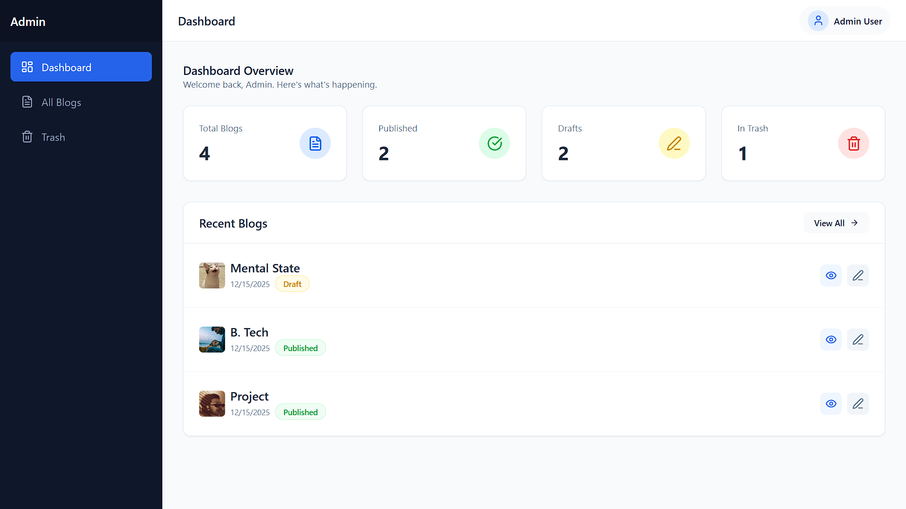
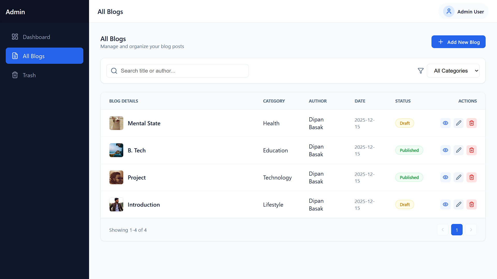
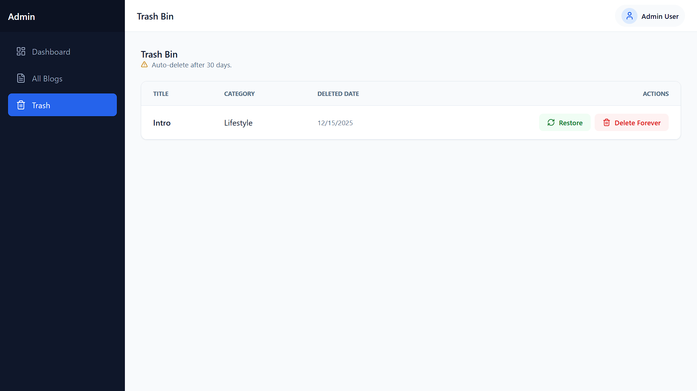
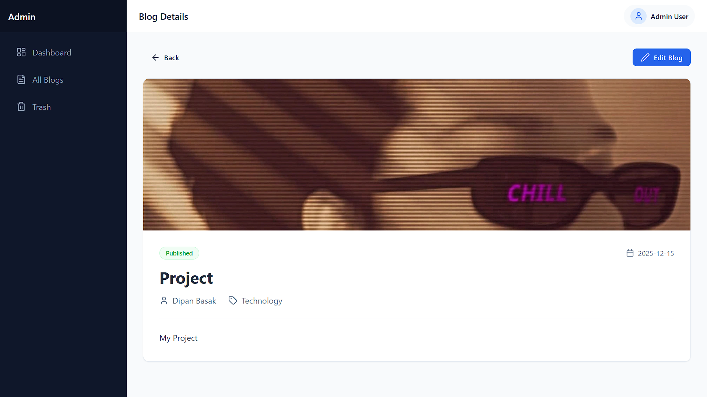
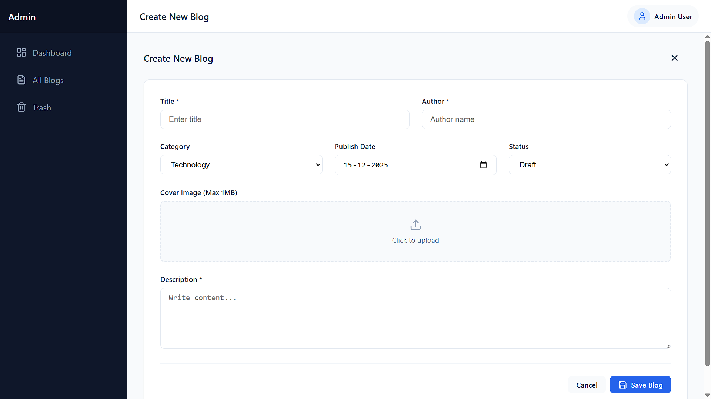
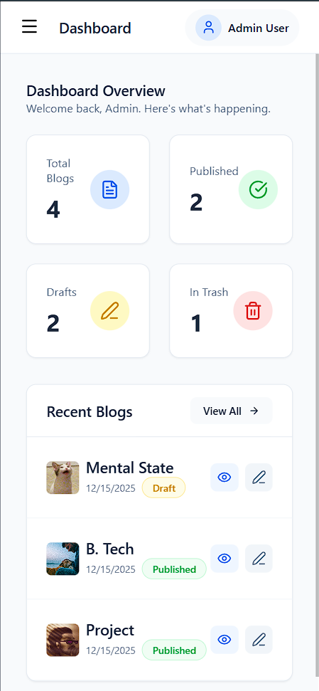
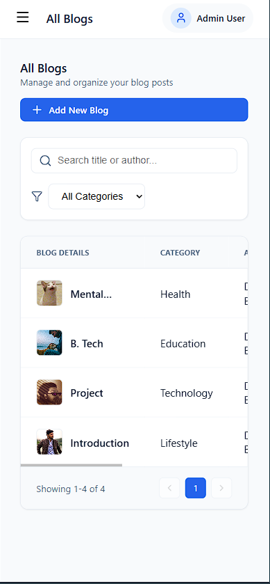
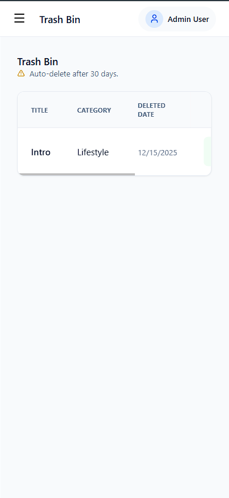
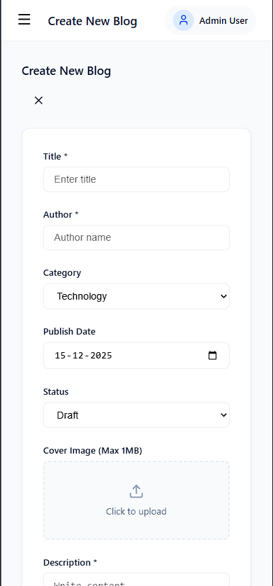
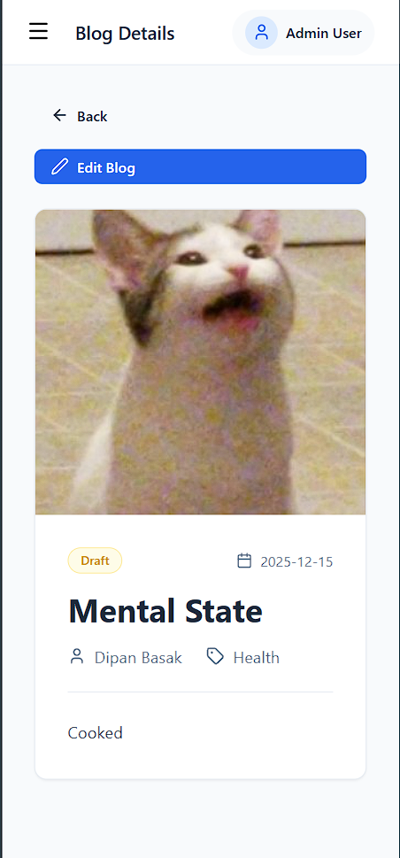
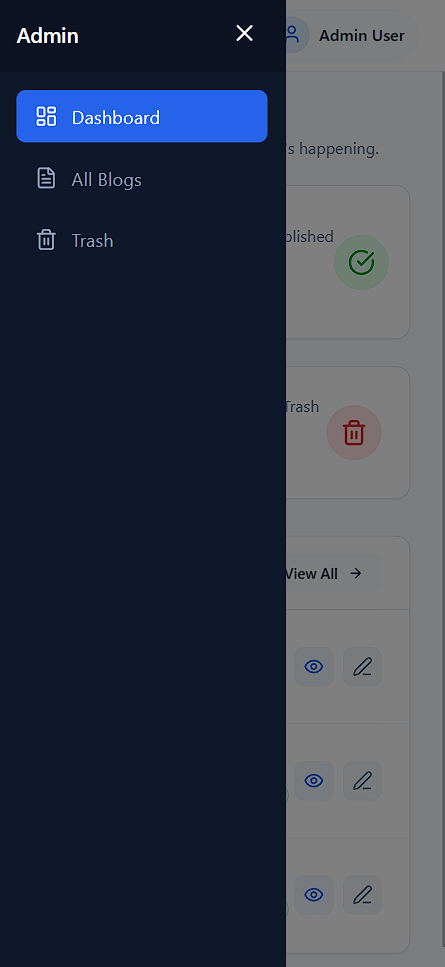

## 🔮 Future Improvements

If you wish to extend this project, consider adding:

1.  **Backend Integration:** Connect to Node.js/Express or Firebase instead of LocalStorage.
2.  **Rich Text Editor:** Replace the standard `<textarea>` with a library like Quill or TinyMCE for formatted blog content.
3.  **Authentication:** Add a Login page to protect the admin routes.
4.  **Dark Mode:** Utilize the CSS variables to implement a toggleable dark theme.
## 📄 License

This project is open source and available under the [MIT License](LICENSE).

---

## 👨‍💻 Author

Made with ❤️ by [Dipan46](https://github.com/Dipan46)
